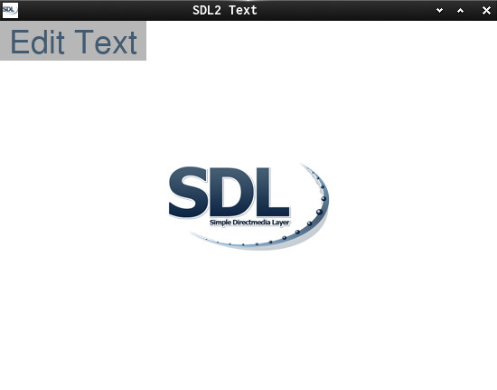

This is a small SDL2 text API demo  
and it does demonstrate how...  

  * to use SDL_Set and GetClipboardText
  * to edit and render text.

Useful links:  
[SDL2](https://www.libsdl.org/) | [SDL-Discourse](https://discourse.libsdl.org) |  [More SDL2 Example Code](https://gist.github.com/Acry/baa861b8e370c6eddbb18519c487d9d8) | 
[SDL2-Text Input Tutorial](https://wiki.libsdl.org/Tutorials/TextInput) | [SDL2-TTF-Demo](https://github.com/Acry/SDL2-TTF)  

Screenshot:  

Assets:  
Fonts:  
[NimbusSanL-Regular](https://fontlibrary.org/en/font/nimbus-sans-l)  

[Get in touch on SDL-Discourse](https://discourse.libsdl.org/u/Acry/summary)
